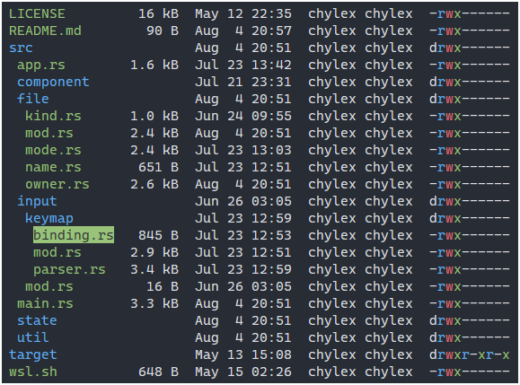

# Bark

`bark` is a tree-based terminal filesystem browser and file manager with `vim`-style key bindings.

# Features

- `ls`-style file listing
- `vim`-style navigation adapted for tree hierarchies
- Basic file management (create, rename, edit, delete)
- Support for Linux and Windows

See [action/mod.rs](https://github.com/chylex/Bark-Browser/blob/main/src/component/filesystem/action/mod.rs) for an up-to-date list of all key bindings.

# Roadmap

- Settings
- File search
- Visual mode for selecting multiple files
- Ex commands for more complex operations
- Directory statistics (total size, number of files, etc.)
- Tree filtering (views that only include certain files)
- Rebindable keys and macros

# Building

1. Install [Rust](https://www.rust-lang.org/tools/install).
2. Run `cargo run` to launch the application.
3. Run `scripts/build.sh` or `scripts/build.bat` to build a release binary into the `out/` folder.

## Windows Subsystem for Linux

Run `wsl.sh` from a Debian-based WSL environment to quickly install Rust and CMake into WSL.

## Docker

Run `docker build --output out .` to build a release binary into the `out/` folder on the host. BuildKit is required.

# Contributing

This project exists 1) because I couldn't find any tree-based file manager I liked and 2) because I wanted to have fun writing Rust, and I don't really want to spend time reading and reviewing pull requests.

For now, issues are closed, and I'm not accepting any major contributions — especially ones related to the roadmap. If you have a small idea, issue, or pull request, feel free to start a [discussion](https://github.com/chylex/Bark-Browser/discussions).
